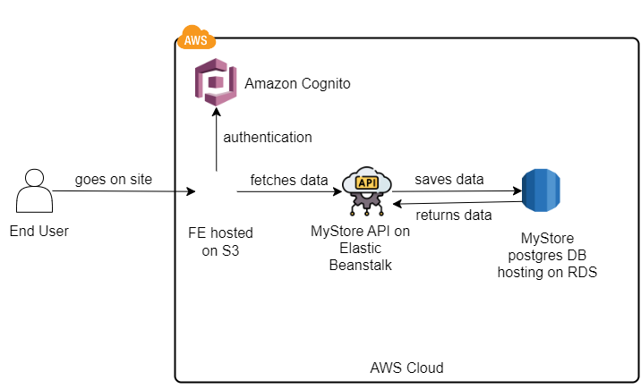

# Infrastructure Description

## Overview

This document outlines the infrastructure components required for our application, including the various AWS services used for hosting the API, frontend, and database.

## AWS Services

### 1. **Elastic Beanstalk**

- **Purpose:** Hosts the application
- **Details:** Automatically handles the deployment, from capacity provisioning, load balancing, auto-scaling to application health monitoring.

### 2. **RDS (Relational Database Service)**

- **Purpose:** Manages the database
- **Details:** Provides scalable and highly available relational database service.

### 3. **S3 (Simple Storage Service)**

- **Purpose:** Stores static files and backups
- **Details:** Scalable object storage with high durability and availability.

### 4. **API Gateway**

- **Purpose:** Manages API requests
- **Details:** Provides a secure and scalable front door for our API services.

### 5. **Load Balancer** (Application)

- **Purpose:** Distributes incoming traffic
- **Details:** Ensures high availability by distributing the application traffic across multiple targets.

### 7. **IAM (Identity and Access Management)**

- **Purpose:** Manages access controls
- **Details:** Provides fine-grained access control across all AWS services.

## Diagram

