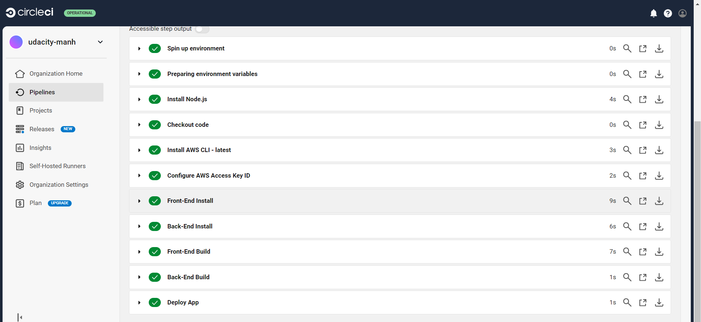

# Pipeline Description

## Overview

This document explains the different steps involved in our CI/CD pipeline, from code commit to deployment.

## Pipeline Steps

### 1. **Source Control**

- **Description:** Code is managed in a version control system like Git (e.g., GitHub, GitLab).
- **Purpose:** Enables collaboration and version tracking.

### 2. **CI Server**

- **Description:** A continuous integration server such as Jenkins or Travis CI is used.
- **Purpose:** Automates the build and testing processes.

### 3. **Build**

- **Description:** Code is compiled and packaged.
- **Purpose:** Prepares the code for deployment and ensures it is in a deployable state.

### 4. **Deploy to Staging**

- **Description:** The application is deployed to a staging environment.
- **Purpose:** Allows for validation and testing in an environment similar to production.

### 5. **Manual Approval**

- **Description:** Optional step where a manual review and approval process takes place.
- **Purpose:** Provides an additional layer of verification before production deployment.

### 6. **Deploy to Production**

- **Description:** The application is deployed to the production environment.
- **Purpose:** Makes the application available to end-users.

### 7. **Monitoring**

- **Description:** Continuous monitoring and logging of the application and infrastructure.
- **Purpose:** Ensures the application is running smoothly and helps in identifying any issues.

## Diagram

